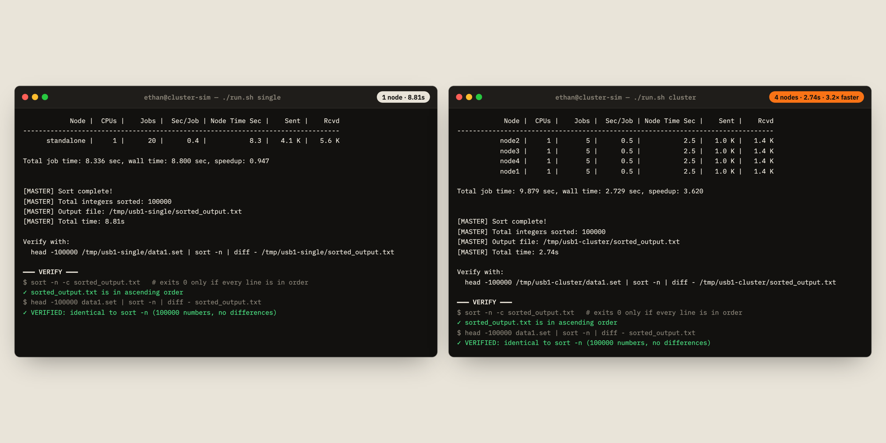
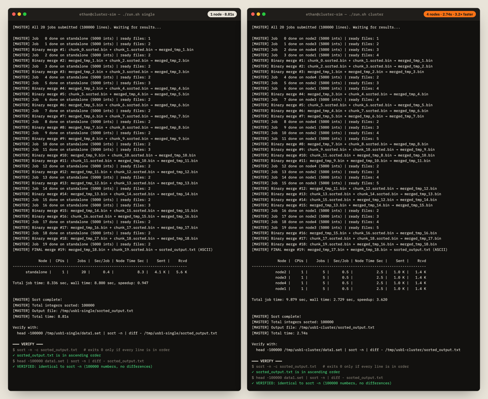

# Local cluster simulation

Runs the distributed sort on a single Mac. Real `dispy` worker processes run on a
simulated network, standing in for the five Orange Pis.



| Real cluster | Simulation |
|---|---|
| 4 Orange Pi workers at 192.168.0.10–.40 | 4 `dispynode` processes on 127.0.0.10–.40, 1 CPU each |
| Master node | `cluster_sort.py` on 127.0.0.1 |
| NFS share at `/mnt/usb1` | `shared/<mode>/`, mounted at `/tmp/usb1-<mode>` so every node sees the same absolute path |

`cluster_sort.py` is the binary-chunk version of the sort: 5,000-int binary chunks,
bubble sort on the workers, and pairwise merges on the master as results arrive.
Worker IPs, paths and chunk sizes come from environment variables, so the same
file runs on the real cluster (defaults) or locally.

## Setup (macOS)

dispy 4.15 doesn't work on Python 3.13, so use Python 3.11:

```bash
cd simulation
python3.11 -m venv .venv          # or: uv venv --python 3.11 .venv
.venv/bin/pip install -r requirements.txt

# Add the 4 worker IPs to the loopback interface (once per reboot, needs your password)
sudo sh -c 'for i in 10 20 30 40; do ifconfig lo0 alias 127.0.0.$i up; done'
```

## Run

```bash
./cluster.sh start     # start node1–node4 plus a standalone node for the baseline
./demo.sh              # opens two Terminal windows: single node vs cluster, side by side
./run.sh single        # or run one mode in the current terminal
./run.sh cluster
./cluster.sh stop
```

Each run generates the same 100,000 random integers (fixed seed), sorts them, and
then checks the result:

```bash
sort -n -c sorted_output.txt                                  # is every line in order?
head -100000 data1.set | sort -n | diff - sorted_output.txt   # were any numbers lost or changed?
```

`demo.sh` runs both modes at once, so they compete for CPU. For clean timings,
run `./run.sh single` and then `./run.sh cluster` one after the other.

## Results

100,000 integers, 20 jobs of 5,000, on an Apple Silicon MacBook Pro, run back to back:

| | Wall time | dispy speedup | Jobs per node |
|---|---|---|---|
| Single node | 8.81s | 0.95× | 20 |
| 4-node cluster | 2.74s | 3.62× | 5 / 5 / 5 / 5 |

Both outputs passed both checks. The ~3.6× speedup is close to the ~3.5× measured
on the original Orange Pi cluster.


